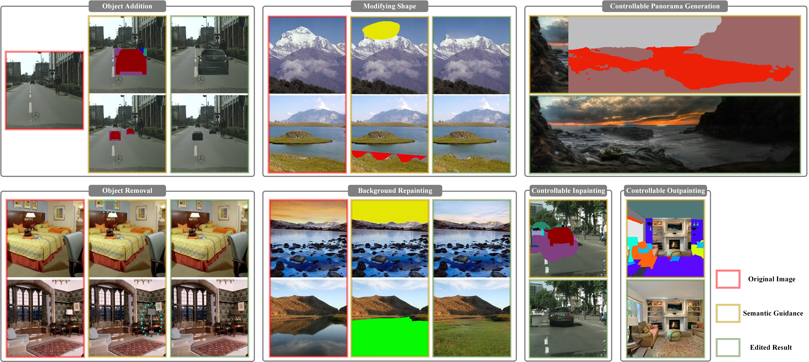

# Context-Consistent Semantic Image Editing with Style-Preserved Modulation

[Paper (ECCV 2022)]()



## Requirements

- The code has been tested with PyTorch 1.10.1 and Python 3.7.11. We train our model with a NIVIDA RTX3090.


## Testing

Download pretrained model ([BaiDuYun (password:z6jz)](https://pan.baidu.com/s/1u4QZALqPjPTvJ5Fr9UIGAQ)), replace the config keys in `configs/landscape_test.yaml` with the path of pretrained model, run
```python
python test.py -t configs/landscape_test.yaml -i data_test/landscape_input.jpg -s data_test/landscape_seg.png -m data_test/landscape_mask.png -c waterother -n water_reflection
```
