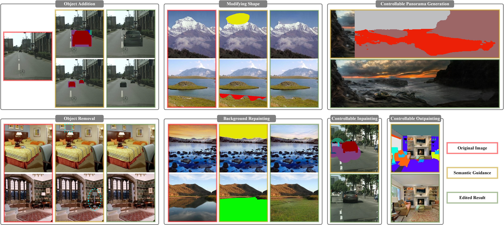

## Context-Consistent Semantic Image Editing with Style-Preserved Modulation
ECCV 2022 [[Paper] (ArXiv)](https://arxiv.org/pdf/2207.06252.pdf)

Semantic image editing utilizes local semantic label maps to
generate the desired content in the edited region. A recent work borrows
SPADE block to achieve semantic image editing. However, it cannot produce pleasing results due to style discrepancy between the edited region
and surrounding pixels. We attribute this to the fact that SPADE only
uses an image-independent local semantic layout but ignores the imagespecific styles included in the known pixels. To address this issue, we
propose a style-preserved modulation (SPM) comprising two modulations processes: The first modulation incorporates the contextual style
and semantic layout, and then generates two fused modulation parameters. The second modulation employs the fused parameters to modulate feature maps. By using such two modulations, SPM can inject
the given semantic layout while preserving the image-specific context
style. Moreover, we design a progressive architecture for generating the
edited content in a coarse-to-fine manner. The proposed method can obtain context-consistent results and significantly alleviate the unpleasant
boundary between the generated regions and the known pixels.



## Requirements

- The code has been tested with PyTorch 1.10.1 and Python 3.7.11. We train our model with a NIVIDA RTX3090 GPU.

## Training

### Dataset Preparation
Download [Cityscapes](https://www.cityscapes-dataset.com/) or [ADE20K](https://groups.csail.mit.edu/vision/datasets/ADE20K/). Create folder `data/dataset_name/` with subfolders `train/` and `test/`. `train/` and `test/` should each have their own subfolders `images/`, `labels/`, `inst_map/`.
- `images/`: Original images.
- `labels/`: Segmentation maps.
- `inst_map/`(optional): Instance maps for generating edge maps. We find edge maps only have a slight impact. If there is no instance map, it can be omitted or replaced with segmentation map.

We include some examples in `data/`, so you can run the training without preparing the dataset. `data/predefined_mask/` contains pre-generated mask maps for testing.

Train a model:
```python 
train.py --dataset_name cityscapes
```

## Testing

Download pretrained model from [BaiDuYun (password:fp4v)](https://pan.baidu.com/s/12S8Ix136UhaUs8j8qyDWeA) | [GoogleDrive](https://drive.google.com/file/d/1rBt9LS8ZueQnOwplIGNED2B22on1VvUd/view?usp=sharing), run
```python 
test.py --dataset_name cityscapes  --ckt_path pretrained_models/cityscapes.pth --image_path data_test/input.jpg --segmap_path data_test/segmap_1.png --mask_path  data_test/mask_1.png
```

## Citation:
If you use this code for your research, please cite our paper.
```
@inproceedings{luo2022context,
  title={Context-Consistent Semantic Image Editing with Style-Preserved Modulation},
  author={Luo, Wuyang and Yang, Su and Wang, Hong and Long, Bo and Zhang, Weishan},
  booktitle={European Conference on Computer Vision},
  pages={561--578},
  year={2022},
  organization={Springer}
}
```

## Acknowledgment
Our code is developed based on [SPADE](https://github.com/NVlabs/SPADE).
